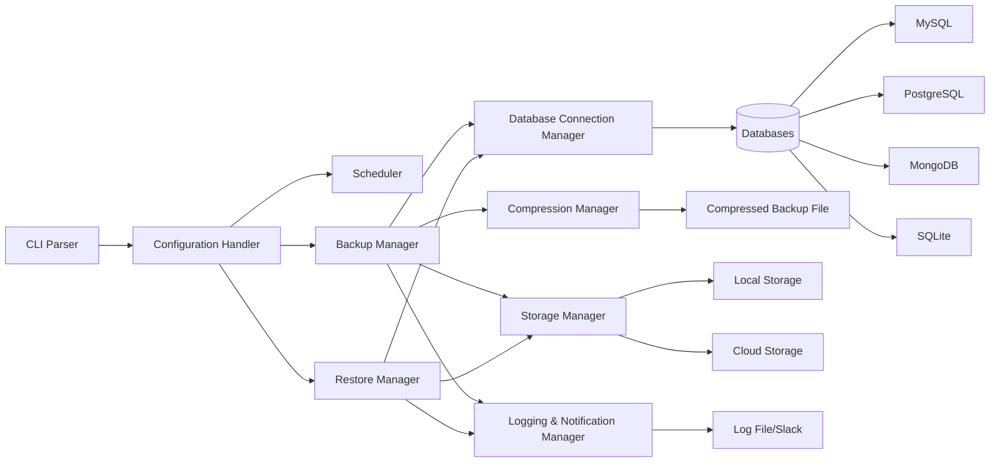

# Database Backup CLI - Architecture Overview

This document provides a high-level overview of the architecture for a C++ Command-Line Interface (CLI) tool designed to back up and restore multiple types of databases (MySQL, PostgreSQL, MongoDB, SQLite, etc.). It explains the core components, the technologies/tools needed to implement them, and includes a system design diagram in Mermaid to visualize the overall structure.

---

## 1. Introduction

The primary goal of this CLI tool is to:
- Connect to various database management systems (DBMS).
- Perform full, incremental, or differential backups.
- Compress the backup data.
- Store backups locally or in the cloud.
- Log and optionally send notifications (e.g., via Slack).
- Restore databases from backup files, including selective restore of specific tables/collections if supported.

The CLI will be user-friendly and able to run on multiple operating systems (Windows, Linux, macOS).

---

## 2. Architecture Components

### 2.1 CLI Interface and Configuration
- **Command Parser**: Parses user commands (e.g., `backup`, `restore`, `schedule`) and command-line arguments.
- **Configuration Handler**: Reads and validates configuration parameters like DB credentials, paths, schedules, and storage settings.

### 2.2 Database Connectivity
- **DB Connection Manager**: Manages connections to MySQL, PostgreSQL, MongoDB, SQLite, or other DBMS.  
  - Uses appropriate C++ libraries/drivers:
    - **MySQL**: MySQL Connector/C++
    - **PostgreSQL**: libpq or libpqxx
    - **MongoDB**: MongoDB C++ Driver
    - **SQLite**: SQLite3 library
  - Validates credentials before backup/restore operations.
  - Handles errors such as connection failures.

### 2.3 Backup Manager
- **Backup Strategy**: Determines if the backup is full, incremental, or differential (based on DB type and user preference).
- **Export/Backup Execution**: Executes DB-specific export commands or uses driver-level data extraction APIs.
- **Compression Manager**: Compresses backup files using a compression library (e.g., zlib, liblzma, or similar).
- **Storage Manager**: Handles saving backups:
  - **Local Storage**: Writes backup to a specified directory on the local system.
  - **Cloud Storage**: Integrates with AWS S3, Google Cloud Storage, or Azure Blob Storage via their respective C++ SDKs.

### 2.4 Restore Manager
- **Import/Restore Execution**: Restores the database from full or incremental backups.
- **Selective Restore**: Allows restoring specific tables/collections when supported.

### 2.5 Scheduling
- **Scheduling Handler**: 
  - Allows automatic backups at specified intervals. 
  - Can integrate with OS-level schedulers like Cron (Linux/macOS) or Task Scheduler (Windows) or implement a basic scheduling mechanism within the application itself.

### 2.6 Logging and Notifications
- **Logging Manager**: Logs events (backup start, end, status, duration, errors) to a file or standard output.  
  - Could use popular C++ logging libraries like [spdlog](https://github.com/gabime/spdlog), [log4cpp](http://log4cpp.sourceforge.net/), or [Boost.Log](https://www.boost.org/doc/libs/release/libs/log/doc/html/index.html).
- **Notification Manager**: Sends Slack (or other) notifications on backup completion or failure. 

---

## 3. Tools Needed (C++)

Below is a non-exhaustive list of libraries and tools that can be used to implement this solution in C++:

1. **C++ Compiler & Build System**  
   - GCC, Clang, or MSVC  
   - CMake or Makefiles for build configuration

2. **Database Drivers**  
   - **MySQL Connector/C++** (official MySQL driver)  
   - **libpq** or **libpqxx** for PostgreSQL  
   - **MongoDB C++ Driver** (official driver from MongoDB)  
   - **SQLite3** library

3. **Compression Library**  
   - [zlib](https://zlib.net/) or [liblzma](https://tukaani.org/xz/) or [bzip2](http://www.bzip.org/)

4. **Cloud Storage SDKs** (only if cloud support is needed)  
   - [AWS SDK for C++](https://aws.amazon.com/sdk-for-cpp/)  
   - [Google Cloud Storage C++ client library](https://github.com/googleapis/google-cloud-cpp)  
   - [Azure Storage C++ SDK](https://github.com/Azure/azure-storage-cpp)

5. **Logging**  
   - [spdlog](https://github.com/gabime/spdlog)  
   - [log4cpp](http://log4cpp.sourceforge.net/)  
   - [Boost.Log](https://www.boost.org/doc/libs/release/libs/log/doc/html/index.html)

6. **JSON/YAML Parser** (for configuration)  
   - [nlohmann/json](https://github.com/nlohmann/json) or [yaml-cpp](https://github.com/jbeder/yaml-cpp)

7. **Command-Line Parsing**  
   - [CLI11](https://github.com/CLIUtils/CLI11)  
   - [cxxopts](https://github.com/jarro2783/cxxopts)

8. **Scheduling**  
   - OS Scheduler (Cron or Task Scheduler)  
   - Custom scheduling logic (using `<chrono>` in C++)

9. **Notification Integration**  
   - [libcurl](https://curl.se/libcurl/) for HTTP requests to Slack's Webhook or any other REST endpoint.

---

## 4. System Design Diagram

Below is a Mermaid diagram illustrating the high-level flow of the system. This diagram shows how user commands pass through the CLI, how backups are processed, compressed, stored, logged, and how optional restore operations are performed.

### Diagram Explanation

The diagram illustrates the system's core components and their interactions:

- **CLI Parser**: Interprets user commands (e.g., backup, restore, schedule)
- **Configuration Handler**: Reads user's configuration parameters (DB credentials, storage preferences, scheduling intervals)
- **Backup Manager**: Orchestrates the backup process using the provided parameters
- **Database Connection Manager**: Manages connections to the chosen DBMS
- **Compression Manager**: Compresses the extracted data to save space
- **Storage Manager**: Handles backup file storage (locally or in the cloud)
- **Logging & Notification Manager**: Records backup details and sends optional notifications (e.g., Slack messages)
- **Restore Manager**: Facilitates database restoration from backup files, with optional selective restore functionality
- **Scheduler**: Triggers automated backups by invoking the Backup Manager at scheduled intervals

## 5. Conclusion

This architecture ensures a modular approach that can be extended to new database types or cloud services as needed. By separating concerns into distinct components (backup, restore, compression, storage, etc.), the tool remains maintainable and scalable. Key benefits include:

- **Modularity**: Each component handles a specific responsibility
- **Extensibility**: New database types or cloud services can be added easily
- **Maintainability**: Components can be updated or replaced independently
- **Transparency**: Comprehensive logging and notification system
- **Automation**: Built-in scheduling for regular backups

With this high-level design in place, the next step is to begin implementing each component, starting with the CLI, configuration parsing, and database connection modules. From there, each module (backup, restore, compression, storage, etc.) can be built and integrated to form a robust, user-friendly backup CLI tool.